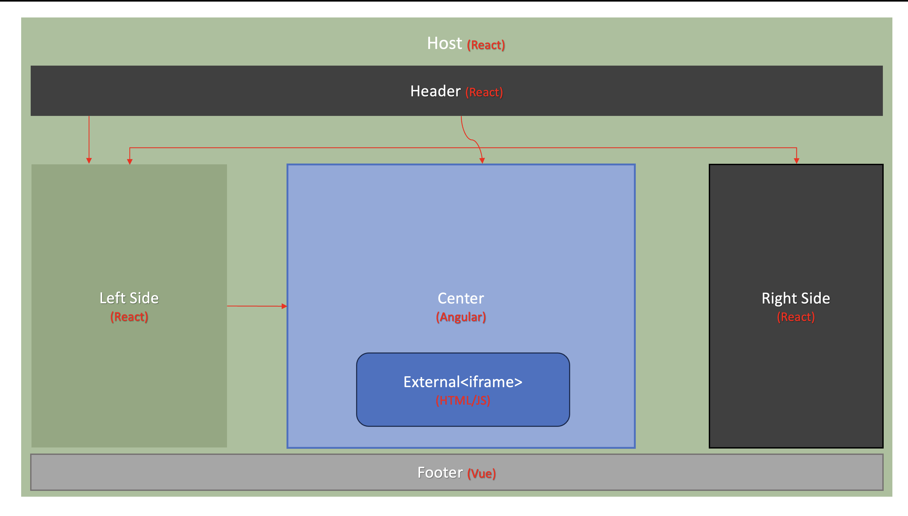
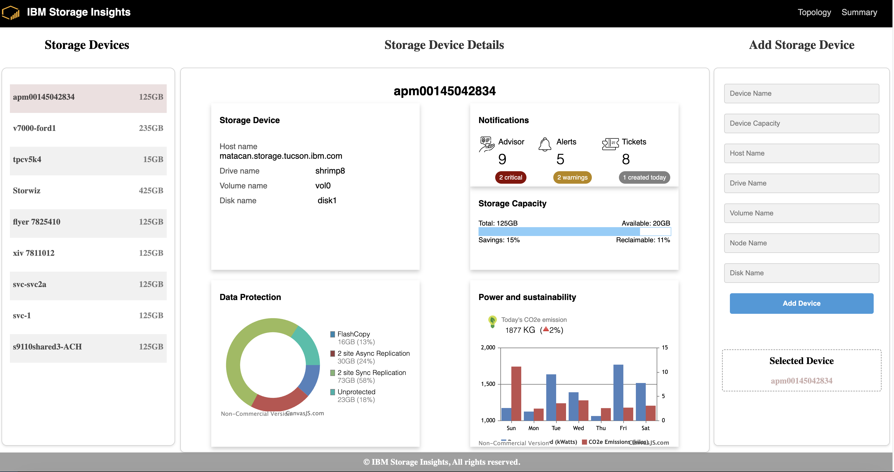
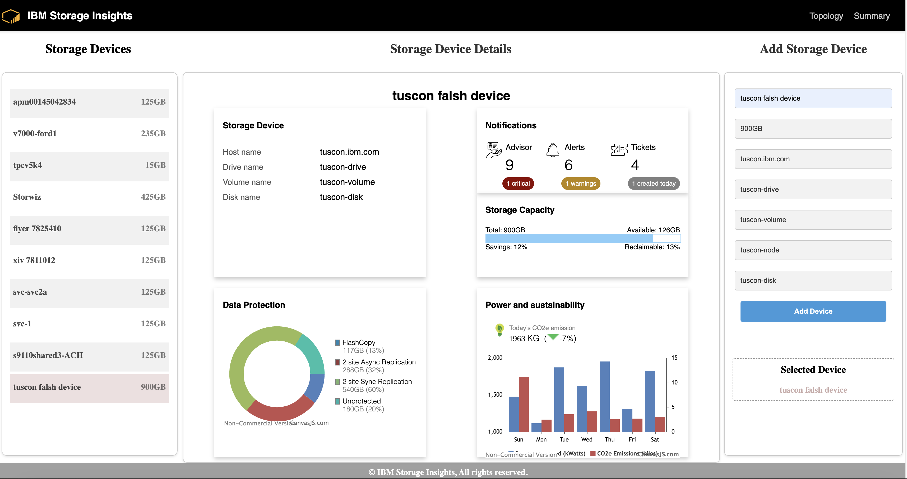
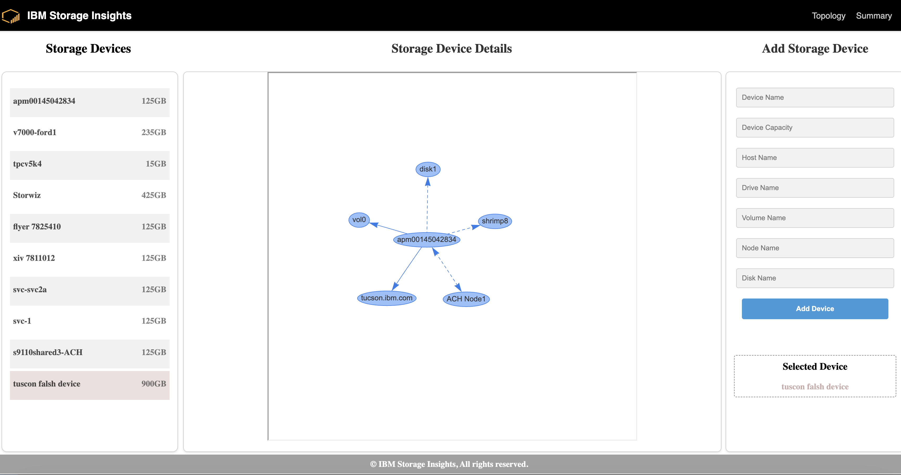

# Micro FrontEnd Architecture for FrontEnd Applications

Please visit the [Wiki](https://github.ibm.com/storage-insights/microfrontend-poc/wiki/Micro-FrontEnd-Architecture-for-FrontEnd-Applications) page for detailed information on the Micro FrontEnd architecture abstraction.

# Running the Applications

To run the applications and set up the development environment, follow the steps below:

## 1. Install Node Modules

- Open a terminal or command prompt.
- Navigate to the root directory of the project.
- Install the node modules for the root directory by running the following command:

`npm install`

## 2. Install Node Modules for MFAs

- Navigate to each Micro FrontEnd application (MFA) located under the `packages` folder.
- Install the node modules for each MFA by running the following command in each MFA's directory:

`npm install`

## 3. Run the Applications

- Once all the node modules are installed, go back to the root directory.
- To run all the MFAs simultaneously, use the following command in the root directory:

`npm run serve`

This command will trigger the necessary scripts defined in the project's configuration, which will start the development servers for each MFA.

By following these steps, you will be able to install the required node modules in the root directory and each MFA, and then run all the applications using the `npm run serve` command from the root directory. Make sure to adapt the steps according to your project's specific configuration and folder structure.

If you encounter any issues or need further assistance, please consult the project documentation or reach out to the project maintainers for support.

Happy development!

## Micro FrontEnd Implementations:

We have implemented a Micro FrontEnd solution that follows the architectural principles outlined in this repository. To explore the various Micro FrontEnd applications (MFA) and their integration, please refer to the **master** branch of this repository.

The **master** branch contains the latest stable version of the entire Micro FrontEnd ecosystem, showcasing the integration of multiple MFAs and their collaboration within a unified frontend architecture. These MFAs are seamlessly integrated using the Webpack bundler, which optimizes and bundles the individual MFA components into a cohesive and performant application.

By leveraging the power of the Webpack bundler, each MFA is developed and maintained as an independent module. This modular approach allows for efficient development, testing, and deployment of individual MFAs while ensuring compatibility and seamless integration within the overall architecture.

The Webpack bundler provides several key benefits in the Micro FrontEnd architecture:

- **Code Isolation**: Each MFA is encapsulated within its own Webpack bundle, allowing for clear separation of concerns and minimizing potential conflicts between different components. This isolation enables independent development and deployment of MFAs, facilitating scalability and modularity.

- **Efficient Dependency Management**: The Webpack bundler efficiently manages dependencies for each MFA, ensuring that only the necessary code and resources are included in the final bundle. This minimizes the overall bundle size and improves performance by reducing network requests and optimizing caching.

- **Dynamic Loading**: The Webpack bundler supports dynamic loading of MFA modules, allowing for on-demand loading and lazy loading of components as required. This enables efficient resource utilization and enhances the user experience by loading components only when needed, reducing initial load times and improving overall performance.

- **Asset Optimization**: Webpack's extensive ecosystem of plugins and loaders enables optimization of assets such as stylesheets, images, and fonts. This ensures efficient delivery and rendering of assets, resulting in a fast and responsive user interface.

The integration of MFAs using the Webpack bundler ensures a seamless and optimized frontend architecture, providing a unified user experience while maintaining modularity and scalability. Each MFA module is bundled and optimized individually, and then seamlessly integrated within the Micro FrontEnd ecosystem, enabling independent development and efficient collaboration between different teams.

Happy exploring and discovering the Micro FrontEnd architecture and its implementations!

We have implemented a micro frontend solution as depicted in the following architectural image:

- **Host**: The Host is a placeholder/container application built using React. It integrates multiple frontend applications (MFA) and acts as the host/container for other MFA. The Host application is capable of sharing data between other MFA. It provides a centralized platform for managing and coordinating the different frontend applications within the ecosystem.

- **Left Side**: This is a reusable component of the Host application that displays fetched data and shares data with other MFA. It serves as a shared data display and communication mechanism for the other MFA components. The Left Side component enables the visualization and interaction with data that is relevant to the entire application ecosystem.

- **Header**: The Header is a React-based MFA responsible for serving navigation/routing mechanisms for the Host application. It provides the main navigation menu, allowing users to switch between different sections or features of the application. The Header MFA handles the routing logic, ensuring that the correct components are loaded based on user interactions.

- **Right Side**: This is a reusable component of the Header MFA that captures user inputs and shares the inputs with the Host application. It provides a user interface for users to provide input or settings that affect the overall behavior of the application. The Right Side component communicates user inputs to the Host application, enabling it to respond accordingly.

- **Center**: The Center is an MFA created using the Angular framework. It is capable of fetching and displaying data from the Host application. It interacts with the Header MFA to determine the active route and display the corresponding components. The Center component forms the central part of the application's user interface, presenting the main content and functionality. It leverages the Angular framework's capabilities for data retrieval, manipulation, and rendering.

- **Footer**: The Footer is an MFA created using the Vue framework. It shares footer content with the Host application, providing consistent footer information across all the MFA components. The Footer component contributes to the overall user experience by displaying relevant information, such as copyright notices, links to legal policies, or additional navigation options.

Here are a few screenshots that showcase the application in action:

The Main Screen showcases the integrated functionality of the entire application, providing users with a comprehensive view of the system's features and capabilities. It serves as the central hub where various modules and functionalities are seamlessly brought together.

- **Header**: The Header component, located at the top of the screen, is a React-based micro frontend application (MFA) responsible for serving navigation and routing mechanisms for the entire application. It provides a consistent and intuitive navigation menu, allowing users to switch between different sections or features seamlessly. The Header MFA handles the routing logic, ensuring that the correct components are loaded based on user interactions.

- **Left Side**: The Left Side component, positioned on the left-hand side of the screen, is a reusable component shared by the Host application and other micro frontend applications (MFA). It displays selected data shared by the Host application, providing users with essential information related to the current context. This shared data could include system-wide statistics, critical alerts, personalized recommendations, or any other relevant information that enhances the user experience. By leveraging the data sharing capabilities of the Host application, the Left Side component ensures a consistent and synchronized view across the entire application ecosystem.

- **Right Side**: The Right Side component, situated on the right-hand side of the screen, is a reusable component shared by the Host application and other MFA components. It captures user inputs and shares them with the Host application, enabling users to provide input or settings that affect the overall behavior of the application. This interactive component empowers users to customize their experience, adjust application preferences, or perform specific actions within the micro frontend context.

- **Center**: The Center section, occupying the central part of the screen, is an MFA created using the Angular framework. It is capable of fetching and displaying data from the Host application. The Center component interacts with the Header MFA to determine the active route and display the corresponding components. It forms the central part of the application's user interface, presenting the main content and functionality. Leveraging the Angular framework's capabilities, the Center section enables data retrieval, manipulation, and rendering to provide users with a rich and dynamic experience.

- **Footer**: The Footer component, located at the bottom of the screen, is an MFA created using the Vue framework. It shares footer content with the Host application, providing consistent footer information across all the micro frontend components. The Footer MFA contributes to the overall user experience by displaying relevant information, such as copyright notices, links to legal policies, or additional navigation options.

The Main Screen brings together these interconnected components, seamlessly integrating the navigation, data display, user input, and footer elements to create a unified and cohesive user experience. Users can explore various features, visualize data, interact with the application, and access system-wide information, all within a single interface. The integration of the Header, Left Side, Center, Right Side, and Footer components ensures a seamless flow of information and interaction throughout the application, enhancing usability and productivity.

This screenshot shows the "Add Device" screen, where users can add new devices to the application. Users can input device details, such as name, description, and category, and submit the form to incorporate the new device into the system.

In this specific screenshot, the Left Side component displays recently added devices, giving users insight into the latest additions to the system. This shared data allows users to quickly access and manage recently added devices without navigating away from the "Add Device" screen. The Host application intelligently shares only the necessary data with the micro frontend applications, optimizing performance and reducing unnecessary data transfers.

The Left Side component of the Host application, visible on the left-hand side of the screen, displays selected data shared by the Host application. It provides users with an overview of relevant information, such as recently added devices, popular device categories, or important system statistics. The Host application selectively shares this data with other micro frontend applications (MFA) to ensure a consistent and synchronized view across the entire ecosystem.

By leveraging the data sharing capabilities of the Host application, the "Add Device" screen provides users with a holistic view of the system while enabling them to perform specific actions within the micro frontend context. This approach enhances the user experience by seamlessly integrating selected data from the Host application into the focused task of adding a new device.

The Topology Screen provides users with a comprehensive view of the network topology, showcasing the interconnectedness of devices and their relationships. It offers insights into the structure and connectivity of the network, empowering users to analyze and manage network configurations effectively.

The Topology Screen is implemented as another standalone micro frontend application (MFA) and integrated within the Angular app as part of the Center MFA. Within the Center MFA, there is a component dedicated to displaying the Topology Screen, which leverages an iframe to embed and render the Topology MFA seamlessly.

The integration of the Topology MFA as an iframe within the Center MFA allows for the seamless switching of components. Users can navigate between different sections within the Angular app, such as the Topology Screen and the Summary component, which displays device details and serves as a dashboard. The Center MFA coordinates the switching of these components based on user interactions with the Header MFA, ensuring a smooth and intuitive user experience.

The Topology Screen, displayed within the iframe, visualizes the network topology using interactive diagrams or graphs. Users can explore the interconnected devices, view their relationships, and access additional details or configuration options. By presenting the network topology in a visually intuitive manner, the Topology Screen empowers users to identify network bottlenecks, troubleshoot connectivity issues, and optimize network configurations.

The seamless integration of the Topology MFA within the Angular app, facilitated by the Center MFA and the use of iframes, enhances the overall functionality and usability of the application. Users can effortlessly switch between the Topology Screen and other components, such as the Summary dashboard, leveraging the capabilities of the Angular framework and the micro frontend architecture to provide a cohesive and efficient user experience.

